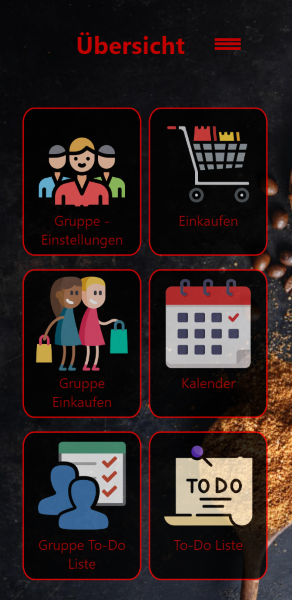
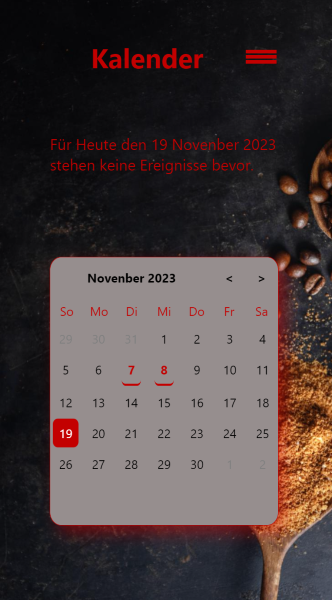
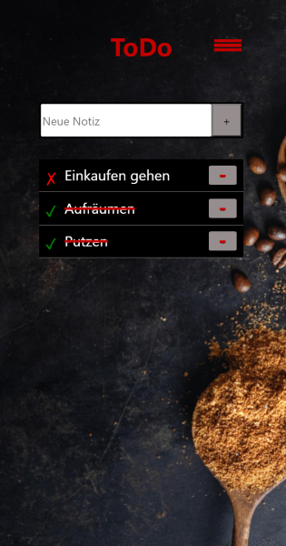
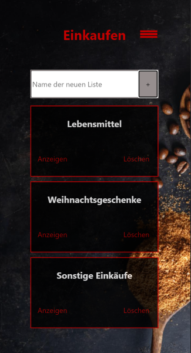

# Mein Haushalt - Haushaltsmanager.

Mein Haushalt ist eine Anwendung, die ihre Benutzer auf eine übersichtliche und benutzerfreundliche Art und Weise bei alltäglichen Erledigungen in kommunikativer und organisatorischer Hinsicht unterstützt. 
Die App bietet nützliche Funktionen wie zun Beispiel einen Kalender in dem Events gespeichert werden können, die Möglichkeit Einkaufslisten zu erstellen sowie das Anlegen von To-Dos.
Des Weiteren können individuelle Gruppen erstellt werden um Einkaufslisten mit Einträgen und To-Dos zu Teilen und somit immer up-to-Date mit seinen Gruppenmitgliedern zu bleiben. 
Die Anwendung unterstützt ein Feature, dass eine Echtzeit aktualisierung von Inhalten gewährleistet. Somit werden die geteilten Inhalte unverzüglich auch bei Gruppenmitgliedern verfügbar.  

## Techstack

- HTML
- CSS
- JavaScript
- JSON
- Node.js

## Anforderungen

- Die aktuelle Version von Node.js ist erforderlich.

## Ausführung und Nutzung des Haushaltsmanagers

Zum Ausführen der Anwendung nutze die folgende Anleitung:

- Clone oder Downloade das gesamte Repository auf deinen Desktop oder in ein Verzeichnis nach Wahl.
- Öffne die Kommandozeile,
- Navigiere mit cd Desktop (oder Verzeichnis nach Wahl) in den geünschten Zielordner,
- Füge den kopierten Link ein und führe den Befehl aus: git clone https://git.wifi.messner.top/Projekte/Projekt-KevinObe.git
- Installiere Node.js auf deinem Gerät, du findest den Download unter: https://nodejs.org/en
- Navigiere nun in den richtigen Ordner mit dem CMD Befehl: cd Projekt-KevinObe
- Führe nun die server.js Datei aus um den Webserver zu starten mit: node server.js
- Öffne in einem Browser deiner Wahl die Seite http://localhost/ und du bist Startklar

## Testdaten für die Ausführung:

Navigiere zur Loginseite und melde dich mit folgenden Daten an:

User 1:
- username: user
- password: user123

User 2:
- username: member
- password: member123

User 3:
- username: ghost
- password: ghost123

Testgruppe:
- groupname: test
- password: test

Der username "user" befindet sich bereits in der angelegten Gruppe "test".
Um die Gruppenfunktionen zu nutzen, melde dich mit dem Userprofil "member" an und trete der Gruppe "test" bei. 
Die Beiden Profile können nun jeweils die geteilten Inhalte einsehen und Bearbeiten.
Die vorbereiteten Inhalte können nach belieben bearbeitet oder gelöscht werden. 
Das Erstellen neuer Gruppen ist jederzeit möglich.

Achtung: Beim verlassen einer Gruppe durch alle Mitglieder, werden die Gruppendaten vom Server gelöscht. Dies kann aktuell nicht mehr Rückgängig gemacht werden. 
Zu Testzwecken wurde hierfür ein dritter User "ghost" angelegt, welcher lediglich einen Lückenfüller darstellt! Dieser kann aber natürlich auch aus der Gruppe entfernt werden. 

# Verwendung und Dokumentation

## Login und Registrierung

Besucher können sich in der Anwendung Registrieren und sich danach Anmelden um die ganzen Features zu nutzen.
Hierzu gibt es eine Login- und eine Registrierungsseite imm Verzeichnis public.
Die Speicherung und Überprüfung der Daten erfolgt Serverseitig. Die dazugehörigen Dateien befinden sich im system Verzeichnis imm Ordner endpoints. 

## Übersicht

Die Übersichtsseite dient komplett zu Navigation innerhalb der Anwendung, von hier aus gelangt ein User in die verschiedenen Gruppenseiten sowie alle Kernfunktionen der App.
Die Seite startet beim rendern eine Abfrage an den Server um die Gruppe des users zu ermitteln. 
Dadurch wird gewährleistet, dass Server Send Events sowie alle Gruppen features richtig funktionieren.
Wenn er nicht Mitglied einer Gruppe ist wird er beim Versuch auf Gruppenseiten zuzugreifen zu den Gruppeneinstellungen umgeleitet. 
Die Features wie Kalender, Einkaufen und To-Dos sind dagegen immer zugänglich, unabhängig vom Gruppenstatus.
Die Dateien dazu befinden sich im private Verzeichnis. 
Server Seitige Dateien dazu im Verzeichnis endpoints. 

## Kalender

Die Kalender Dateien befinden sich im private Verzeichnis der Anwendung. 
Hier wird die Kalender Seite mit dem aktuellen Datum und den Notwendigen Daten mittels einer Server abgfrage gerendert.
Dem User werden die gespeicherten Ereignisse und das aktuelle Datum angezeigt.
Beim Auswählen eines Tages, wird auf die Seite events.html weitergeleitet und dort die Möglichkeit geboten, Ereignisse zu erstellen. 

## To-Do

Innerhalb der To-Do Funktion wird eine Abfrage gestartet welche die gespeicherten Einträge lädt und rendert. 
Die Gruppen-ToDos und die privaten To-Dos unterscheiden sich im Wesentlichen nur dadurch, dass die Inhalte in der Gruppenseite geteilt werden. Durch Server Send Events werden die User dabei am laufenden gehalten ob ein Gruppenmitglied die gespeicherten Daten verändert. 
To-Dos können erstellt, erledigt, gespeichert und gelöscht werden. Diese Veränderungen werden in der Gruppen-ToDo Seite vom Server erkannt und in Echtzeit geupdatet bei anderen Gruppenmitgliedern. 
Die Dateien befinden sich im private Verzeichnis unter groupNotes und notes, Serverseitige Features befinden sich im endpoints Verzeichnis unter den jeweiligen Namen. 

## Einkaufen

Die Einkaufslisten werden beim Aufrufen der Seite vom Server geladen und beim User gerendert. Hier unterscheiden sich die Gruppe-Einkaufen Seite und die private Einkaufen Seite nur durch ihre geteilten Inhalte. 
Die Listen die innerhalb der Gruppenseite erstellt werden, werden in Echtzeit für alle Gruppenmitglieder verfügbar. 
Änderungen in diesen werden ebenfalls erkannt und geteilt. 
Die Liste lässt sich nach dem Erstellen öffnen und darin können Einträge gespeichert werden. 
Die zugehörigen Dateien befinden sich im private Verzeichnis in den Ordnern groupShopping sowie shopping. Serverseitige Dateien befinden sich im endpoints Verzeichnis. 

# Bekannte Fehler (Work in Progress)

Hier werden zukünftige Fehler und Bugs sowie sich in Entwicklung befindliche Features aufgelistet. 

- Roadmap für das Jahr 2024

# Für Entwickler

Zur Weiterentwicklung führe folgende Schritte aus:

- Clone oder Downloade das gesamte Repository auf deinen Desktop oder Verzeichnis nach Wahl.
- Zum Clonen öffne die Kommandozeile,
- Navigiere mit cd Desktop (oder Verzeichnis nach Wahl) in den geünschten Zielordner,
- Führe den Befehl aus: git clone https://git.wifi.messner.top/Projekte/Projekt-KevinObe.git
- Installiere Node.js auf deinem Gerät, du findest den Download unter: https://nodejs.org/en
- Öffne einen Code Editor wie zum Beispiel Visual Studio Code,
- Nutze die Kommandozeile in VS-Code und gib folgenden Befehl ein: node server.js
- Öffne in einem Browser deiner Wahl die Seite http://localhost/ und du bist Startklar

# Weiterentwicklung / Vorschläge / Verbesserungen

Für weitere Verbesserungen und Vorschläge clone das Projekt wie oben beschrieben und erstelle einen eigenen Branch mit den Dazugehörigen Features und Vorschlägen. 
- Wechsle ins geclonte Projekt-Verzeichnis auf der Kommandozeile mittels: cd
- Erstelle den Branch: (git checkout -b feature/AmazingFeature)
- Commite deine Änderungen (git commit -m 'Add some AmazingFeature')
- Pushe deine Änderungen oder Vorschläge (git push origin feature/AmazingFeature)

# Auslieferung

## Hier befindet sich eine Übersicht über das ausgelieferte Projekt und all seinen Dateien für Entwickler:

- Die Notwendigen Verzeichnisse werden beim Serverstart automatisch erstellt.
- config: 
  - Datei "checkDir.server.js", welche die Ordner überprüft und sicherstellt, dass das Verzeichnis groups im Dateisystem existiert.
  - Das Verzeichnis "groups" in welchem sich die gespeicherten Daten sowie die Profile von erstellten Gruppen befinden.
  - Datei "port.json" welche den Server Port festlegt auf welchen der Server bei anfragen hören soll.
  - "register.json" um fest zu legen ob man die Regsitrierungsoption des Servers aktivieren will.
  - "sessions.json" welche die Dauer und die änderbaren Einstellungen für sessions festlegt.
- docs:
  - Alles rund ums Thema Projektmanagement zur Anwendung.
- endpoints:
  - Alle Wichtigen Serverseitigen Endpunkte um die jeweiligen Anfragen zu bearbeiten.
  - calendar.server.js: 
      '/api/v1/savedEvents' : Abrufen gespeicherter Events um sie im Kalender zu Rendern.
      '/api/v1/calendarEvents/:id' : Erstellung und Speicherung neuer Events am Server.
      '/api/v1/calendarEvents' : Zwischenspeicherung des ausgewählten Tages um Events zu erstellen. 
  - notes.server.js: 
      - '/api/v1/notes' : Übergibt gespeicherte To-Dos zum Rendern an den Client.
      - '/api/v1/notes/:id' : Bearbeitet eingehende neue To-Dos und speichert diese, Sorgt für korrektes Löschen bei 'DELETE' requests. 
  - shopping.server.js: 
      - '/api/v1/shoppingLists' : Übergibt gespeicherte Einkaufslisten zum Rendern an den Client.
      - '/api/v1/shoppingLists/:id' : Bearbeitet eingehende neue Einkaufslisten und speichert diese, Sorgt für korrektes Löschen bei 'DELETE' requests.
  - shoppingList.server.js: 
      - '/api/v1/shoppinglist/:id' : Überprüft welche Einkaufsliste ausgewählt wurde um die Richtigen Einträge und Daten zurück zu geben.
      - '/api/v1/shoppinglist' : Übergibt gespeicherte Listeneinträge zum Rendern an den Client, je nach ausgewählter Liste.
      - '/api/v1/shoppingList/:id': Bearbeitet eingehende neue Einträge in den Listen und speichert diese, Sorgt für korrektes Löschen bei 'DELETE' requests.
  - createGroup.server.js:
      '/api/v1/createGroup' : Sorgt für die Erstellung von Gruppen und deren Speicherung im Dateisystem.
  - groups.server.js:
      '/api/v1/checkGroup' : Überprüft ob der User sich bereits in einer Gruppe befindet, wird für die Gruppenfunktionen benötigt.
      '/api/v1/leaveGroup' : Bearbeitet das Verlassen von Gruppen eines users und räumt im Dateisystem auf wenn die Gruppe leer ist.
  - joinGroup.server.js:
       '/api/v1/joinGroup' : Bearbeitet das Beitreten und überprüft ob Gruppenname sowie Passwort korrekt sind. 
  - groupNotes.server.js:
    - '/api/v1/groupNotes' : Übergibt gespeicherte Gruppen To-Dos der user in der Gruppe zum Rendern an den Client. 
    - '/api/v1/groupNotes/:id' : Bearbeitet eingehende neue Gruppen To-Dos und speichert diese, Sorgt für korrektes Löschen bei 'DELETE' requests. 
  - shopping.server.js: 
    - '/api/v1/groupShoppingLists' : Übergibt gespeicherte Gruppen Einkaufslisten der Gruppe des users zum Rendern an den Client.
    - '/api/v1/groupShoppingLists/:id' : Bearbeitet eingehende neue Einkaufslisten und speichert diese, Sorgt für korrektes Löschen bei 'DELETE' requests.
  - groupShoList.server.js: 
    - '/api/v1/groupShoppinglist/:id' : Übergibt gespeicherte Listeneinträge zum Rendern an den Client, je nach ausgewählter Liste.
    - '/api/v1/groupShoppinglist' : Übergibt die geclickte Liste und deren Einträge an der Client zum Rendern der Daten.
    - '/api/v1/groupShoppingList/:id' : Bearbeitet eingehende neue Einträge in den Listen und speichert diese, Sorgt für korrektes Löschen bei 'DELETE' requests.
  - imgCache.js:
    - Die Endpunkte bearbeiten jeweils die Anfragen von private oder public Seiten um den Hintergrund im cache zu speichern und somit unnötig häufiges Laden zu vermeiden.
  - live.server.js: 
    - Endpunkt der die liveClients für die Server Send Event Messages im liveClients Array speichert um eine Auslieferung der Nachrichten zu gewährleisten. Haltet die Verbindung zu den Usern offen. 
- library: 
  - "SSE.js" um die Server Send Event Mitteilungen zu verarbeiten und an online user zu senden. 
- private:
  - Alle Wichtigen Kernfunktionen sowie deren html, css und js Dateien die sie zum laufen benötigen.
  - Dateien im private Verzeichnis sind nur für registrierte und angemeldete user mit gültiger session zugänglich. 
  - Die Verzeichnisse der Funktionen gliedern sich in: 
    - calendar: alle Dateien der Kalender Funktionen, 
    - notes: alle Dateien zum Erstellen und speichern von To-Dos, 
    - shopping: alle Dateien zum Erstellen und speichern von Einkaufslisten, sowie der Listeneinträge, 
    - groups: alle Dateien zum Erstellen, beitreten und verlassen von Gruppen,
    - groupNotes: alle Dateien zum Erstellen und speichern sowie dem Teilen von To-Dos innerhalb der eigenen Gruppe,  
    - groupShopping: alle Dateien zum Erstellen und speichern sowie dem Teilen von Einkaufslisten sowie den Listeneinträgen  innerhalb der eigenen Gruppe,   
    - impressum: Impressum und Datenschutzerklärung für angemeldete User im Private Verzeichnis,
- public: 
  - Beinhaltet allgemein zugängliche Dateien und Verzeichnisse;
  - Gliedert sich in:
    - Impressum: Impressum sowie Datenschutz Inhalte der Anwendung, für alle zugänglich;
    - logout: Beinhaltet die Dateien die den Logout behandeln;
    - register: Dateien die die registrierungsdaten an den Server senden und die Registrierung behandeln;
    - alert.js, alert.html, alert.css: behandeln die Mitteilungen die ein User innerhalb der Anwendung erhält;
    - login: bearbeitet den Login und sendet die Daten an den Server zur Überprüfung;
    - mobileMenu, common.css, startpage: beinhalten die Standard CSS settings und die dazu gehörigen mnobilen Menüs sowie die Startseite der Anwendung;
- system:
  - Alle Systemrelevanten Dateien, die im Backend mit dem Server arbeiten und Endpunkte, Login, Register, Logout und sonstige Abhängigkeiten behandeln;
- users:
  - wird erstellt bei Registrierung und beinhaltet die Userdaten die gespeichert werden während der session;
- server.js:
  - Die hauptdatei des Node.js Webservers, diese muss zum starten der Anwendung ausgeführt werden. 
